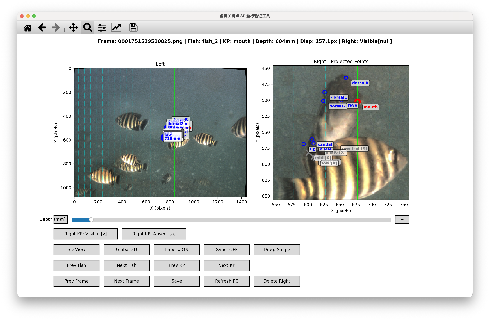
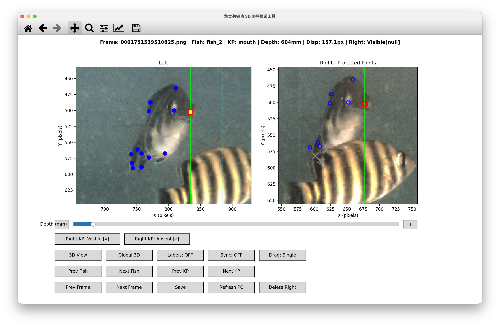
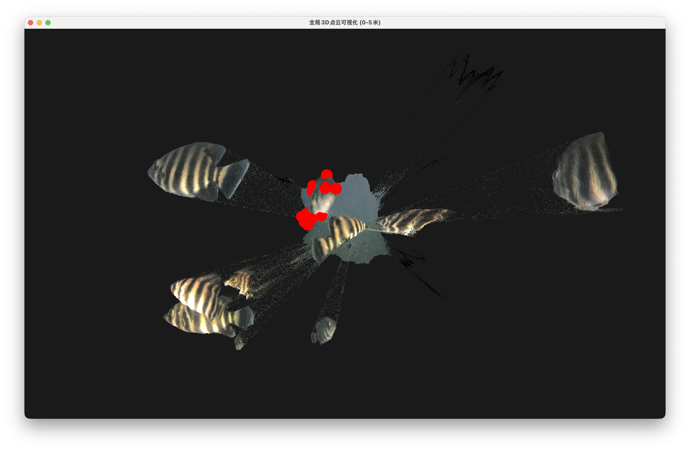
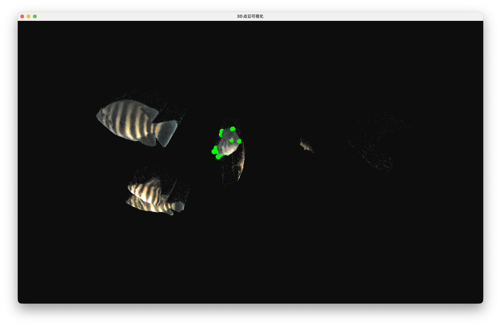
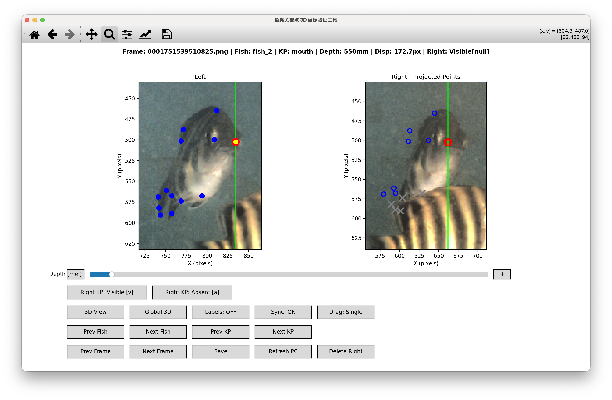
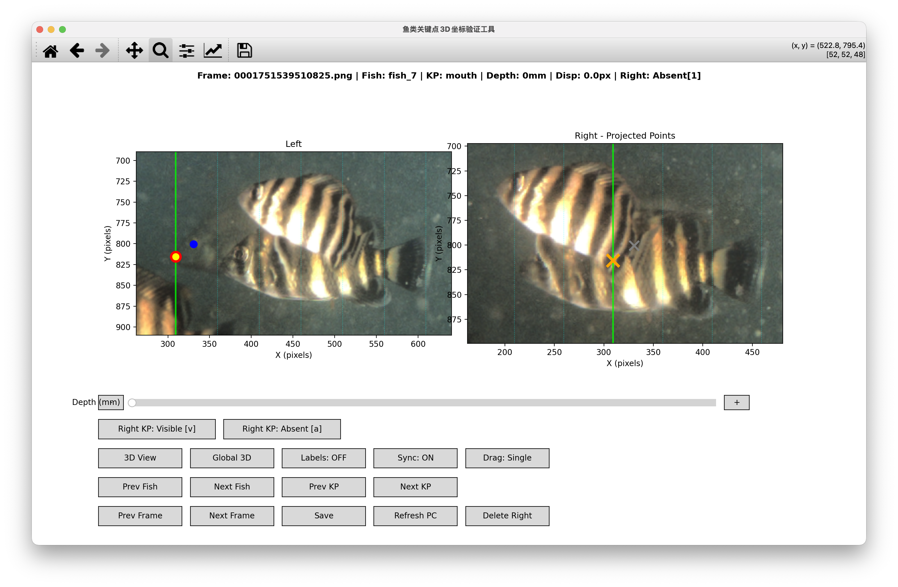

# 鱼类关键点3D坐标验证和调整工具

一个用于验证和调整鱼类关键点3D坐标的专业标注工具，支持左右目双子图、实时3D点云可视化和深度调整，可生成右图 LabelMe 标注。

## 功能特性

- ✅ **左右目双子图**：左图（原始标注）与右图（双目投影）并排显示，带参考竖线
- ✅ **3D点云可视化**：支持局部（当前鱼深度范围）和全局（0–10m）点云显示
- ✅ **实时交互**：帧、鱼类、关键点导航；Depth 滑块 + 加减按钮调整深度
- ✅ **同步深度模式**：当前鱼所有关键点联动调整（Sync: ON/OFF）
- ✅ **右图关键点编辑**：右图可见性（Visible/Absent）、拖动微调、Single/Global 模式
- ✅ **Delete Right**：丢弃当前鱼右图标注，整鱼深度重置为无效
- ✅ **标签开关**：显示/隐藏关键点标签（Labels: ON/OFF）
- ✅ **自动保存**：左图与右图 JSON 实时保存
- ✅ **多进程架构**：GUI 子进程避免界面冲突

## 环境要求

- Python 3.9+
- OpenCV
- NumPy
- Matplotlib
- Open3D（可选，用于 3D 可视化）
- PyYAML

## 安装依赖

```bash
pip install opencv-python numpy matplotlib pyyaml open3d
```

## 数据集结构

```
fish_dataset/
├── images/
│   ├── left/                    # 左目原始图像
│   │   ├── 0001751539505827.png
│   │   └── ...
│   └── right/                   # 右目图像（用于右图标注可视化）
│       └── ...
├── depths/                      # 深度(视差)图 (numpy 格式)
│   ├── 0001751539505827.npy
│   └── ...
├── annotations/
│   └── labelme/
│       ├── left/                # 左图 LabelMe 标注（主标注源）
│       │   ├── 0001751539505827.json
│       │   └── ...
│       └── right/               # 右图 LabelMe 标注（工具自动生成）
│           └── ...
└── camera_configs/
    └── mocha_stereo_params.yaml
```

## 使用方法

### 1. 启动工具

```bash
python verify_fish_3d_keypoints.py \
  --dataset_root fish_dataset \
  --camera_config fish_dataset/camera_configs/mocha_stereo_params.yaml \
  --default_annotation fish_dataset/annotations/labelme/left/fishdata.json
```

| 参数 | 说明 |
|------|------|
| `--dataset_root` | 数据集根目录（默认：fish_dataset） |
| `--camera_config` | 相机配置文件路径 |
| `--default_annotation` | 默认标注文件路径（当对应帧的标注文件不存在时使用） |

### 2. 主界面操作

启动后显示左右目双子图及多行按钮。详见下方「标注工作流程」中各步骤对应截图说明。

#### 帧与鱼类导航
- **Prev Frame / Next Frame**：上一帧 / 下一帧
- **Prev Fish / Next Fish**：上一条鱼 / 下一条鱼
- **Prev KP / Next KP**：上一个关键点 / 下一个关键点（当前关键点以黄色高亮）

#### 深度操作
- **Depth 滑块**：调整当前关键点深度（0–10000 mm）
- **+ / -**：快速增减当前关键点深度
- **Sync: ON/OFF**：同步模式开启时，调整当前关键点深度会联动当前鱼所有关键点
- **Delete Right**：丢弃当前鱼右图标注，并将该鱼所有关键点深度重置为无效（0 mm）；拖动 Depth 滑块赋值后可解除抛弃，下次 Save 时恢复右图构建

#### 点云与 3D
- **Refresh PC**：重新加载点云显示范围
- **3D View**：局部点云（当前鱼深度范围）
- **Global 3D**：全局点云（0–10 m）

#### 右图关键点
- **Right KP: Visible [v]**：将当前关键点在右图中标记为可见（group_id=null）
- **Right KP: Absent [a]**：将当前关键点在右图中标记为不存在（group_id=1，SGBM 筛除或手动设置）
- **Drag: Single / Global**：Single 仅拖动当前关键点；Global 可拖动任意关键点
- 支持在右图上**鼠标拖动**关键点微调（双目重叠区 256–1439 px 内）

#### 视图与保存
- **Labels: ON/OFF**：显示 / 隐藏关键点标签
- **Save**：保存左图与右图 JSON

### 3. 3D 可视化说明

#### 局部 3D 视图（3D View）
- 显示当前鱼关键点深度范围内的点云
- 绿色球体表示关键点
- 点云使用图像颜色着色

#### 全局 3D 视图（Global 3D）
- 显示 0–10 m 深度范围内的所有点云
- 红色球体表示关键点
- 便于识别难以标注的鱼

### 4. 标注工作流程

> 下图关键点位置并非实际标注位置，仅用于示意。

1. **启动工具**，加载第一帧。主界面：左图+右图双子图、各按钮、第一帧已加载。若要开始拖动深度或标注关键点，请先点击Next KP或Prev KP，加载出参考线。

   

2. **Next Fish** 切换到目标鱼类。可点击左上角的放大镜，在图中框选目标进行放大。单击左上角的房子可以回到初始图像。单击左上角的十字交叉箭头可以拖动图像。

   

3. 观察**左图**确认 2D 关键点位置。左图高亮当前关键点（黄色），可辨关键点与鱼体对应关系。若标签遮挡关键点，可点击Labels: ON/OFF 开关切换显示。

   

4. 点击 **Global 3D** 观察全局点云。全局 3D 窗口：0–10 m 点云、红色关键点球体、多鱼场景。左键旋转，中键平移，滚轮缩放，Q退出窗口。

   

5. 点击 **3D View** 查看局部点云。局部 3D 窗口：当前鱼深度范围点云、绿色关键点球体。左键旋转，中键平移，滚轮缩放，Q退出窗口。可以根据用户拖动深度实时更新点云位置，切换鱼时需要手动点击Refresh PC刷新或者按Q退出再重新进入。

   

6. 使用 **Depth 滑块** / **+/-** 调整深度。界面展示 Depth 滑块数值、右图关键点随深度变化的位置。可以点击 **Sync: ON/OFF** 开关切换同步模式，Sync ON时，会对当前鱼类的所有关键点进行同步调整。

   

7. 如果觉得滑块调整不方便，可以直接在右图中**鼠标拖动**关键点微调。 **Drag: Single / Global** 切换拖动模式，Single 仅拖动当前关键点，Global 可拖动 **当前** 鱼类的任意关键点。

8. 右图关键点被遮挡时 **Right KP: Absent [a]** 或 按下键盘上的`a`键。右图某关键点被标记为 Absent（group_id=1），此时被遮挡关键点在右图中会被显示为灰色的X，见上图鱼尾部分。若需要恢复，可以点击 **Right KP: Visible [v]** 或 按下键盘上的`v`键。

9. 当画面中所有关键点都被遮挡或者不可见时，务必点击 **Delete Right**。当前鱼所有关键点深度已重置为 0，右图该鱼已抛弃。若手误，可以拖动Depth滑块赋值来恢复右图构建。若关键点超出左右视角共同视野范围，则该关键点不会在右图中显示，不必理会这些点，若不放心，可以手动将深度调整成0。

   
   

10. **Refresh PC** 刷新查看局部点云是否正确。

11. **Save** 保存结果，每一帧标注完成后都需要点击Save保存结果。

12. **Next Frame** 切换到下一帧。已切换到下一帧，继续标注。

    

### 5. 深度数据说明

- **点云有效深度范围**：0–10000 mm
- **深度为 0**：表示该关键点深度无效（reset 标记）
- **左图 JSON**：`description` 格式：`"depth: 4183.29mm"` 或 `"depth: 0.00mm (reset - invalid depth)"`
- **右图 JSON**：由工具根据左图投影与过滤规则自动生成并保存，标注完成后需要在labelme中再次进行检查，确保正确生成了json，且框的位置正确。若发现问题，不可调整右图的关键点，仅可调整框的大小、位置。

### 6. 键盘快捷键

- **v**：将当前关键点在右图设为可见（Visible）
- **a**：将当前关键点在右图设为不存在（Absent）
- **Q**：关闭 3D 窗口或主窗口

## 注意事项

### 数据一致性
- 图像、深度、标注文件 basename 需一致
- 左图标注为 LabelMe JSON 格式；右图由工具生成

### 深度调整建议
- 优先观察左右图关键点对应位置是否一致，可以借助参考线或鱼体周围的纹理进行判断。
- 可以使用 Global 3D 观察大致深度。
- 可以使用 3D View 查看标注精度。
- 整鱼被遮挡或出画或关键点超出共同视野范围时使用 Delete Right 标记无效

### 故障排除
- **Open3D 未安装**：3D 功能不可用，2D 标注正常
- **深度文件加载失败**：检查 .npy 格式和路径
- **标注文件格式错误**：确保 LabelMe JSON 格式正确

## 输出格式

### 左图 JSON（关键点 example）

```json
{
    "label": "dorsal0",
    "points": [[483.2, 891.4]],
    "group_id": null,
    "description": "depth: 4183.29mm",
    "shape_type": "point",
    "flags": {},
    "mask": null
}
```

### 右图 JSON（由工具生成）

- 包含投影后的 fish bbox 与关键点
- 关键点 `group_id`：`null` 表示可见，`1` 表示不存在（Absent）
