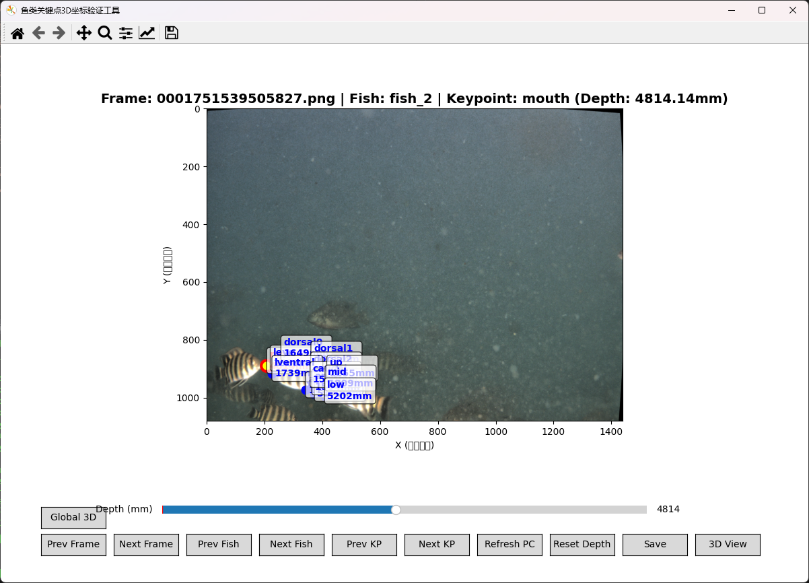
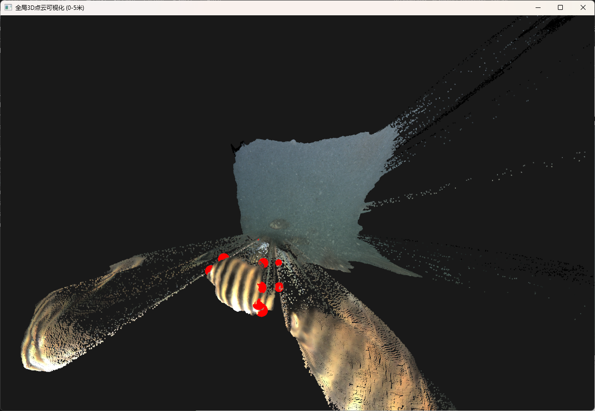
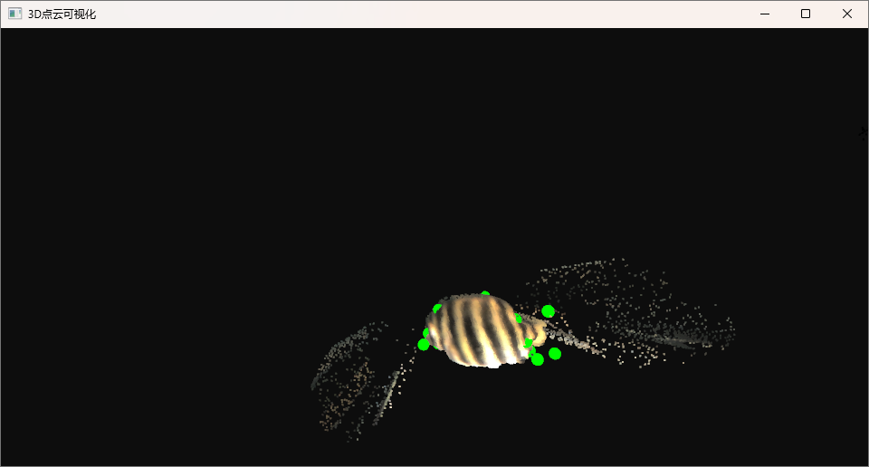

# 鱼类关键点3D坐标验证和调整工具

一个用于验证和调整鱼类关键点3D坐标的专业标注工具，支持实时3D可视化和深度调整。

## 功能特性

- ✅ **2D可视化界面**：显示原始图像和关键点标注
- ✅ **3D点云可视化**：支持局部和全局点云显示
- ✅ **实时交互**：切换帧、鱼类、关键点
- ✅ **深度调整**：手动调整关键点深度值
- ✅ **深度重置**：将当前鱼的所有关键点重置为无效深度
- ✅ **自动保存**：实时保存标注结果到JSON文件
- ✅ **多进程架构**：GUI子进程避免界面冲突

## 环境要求

- Python 3.9+
- OpenCV
- NumPy
- Matplotlib
- Open3D (可选，用于3D可视化)
- PyYAML

## 安装依赖

```bash
pip install opencv-python numpy matplotlib pyyaml open3d
```

## 数据集结构

```
fish_dataset/
├── images/                 # 原始图像文件
│   ├── 0001751539505827.png
│   └── ...
├── depths/                 # 深度(视差)图文件 (numpy格式)
│   ├── 0001751539505827.npy
│   └── ...
├── annotations/
│   └── labelme/           # LabelMe格式标注文件
│       ├── 0001751539505827.json
│       └── ...
└── camera_configs/        # 相机配置文件
    └── mocha_stereo_params.yaml
```

## 使用方法

### 1. 启动工具

```bash
python verify_fish_3d_keypoints.py --dataset_root fish_dataset --camera_config fish_dataset/camera_configs/mocha_stereo_params.yaml
```

### 2. 主界面操作

启动后会显示一个包含多个按钮的matplotlib界面：

#### 帧导航
- **Prev Frame / Next Frame**：切换到上一帧/下一帧数据

#### 鱼类导航
- **Prev Fish / Next Fish**：切换到上一条/下一条鱼
- 界面会显示当前鱼的关键点信息

#### 关键点导航
- **Prev KP / Next KP**：切换到上一个/下一个关键点
- 当前关键点会以黄色高亮显示

#### 深度操作
- **Depth滑块**：调整当前关键点的深度值 (0-10000mm)
- **Reset Depth**：将当前鱼的所有关键点深度重置为0mm（标记为无效）

#### 点云操作
- **Refresh PC**：重新加载点云显示范围

#### 3D可视化
- **3D View**：显示局部点云（当前鱼深度范围）
- **Global 3D**：显示全局点云（0-10米范围）
- **GUI 3D Windows**：启动独立的3D可视化进程（推荐）

#### 保存操作
- **Save**：保存当前所有关键点的深度信息到JSON文件

### 3. 3D可视化说明

#### 局部3D视图（3D View）
- 显示当前鱼关键点深度范围内的点云
- 绿色球体表示关键点
- 点云使用图像颜色着色

#### 全局3D视图（Global 3D）
- 显示0-10米深度范围内的所有点云
- 红色球体表示关键点（区别于局部视图）


### 4. 标注工作流程

1. **启动工具** 加载第一帧数据
    
2. **使用Next Fish切换到目标鱼类**
3. **观察2D界面**确认关键点位置
4. **点击Global 3D** 启动全局3D可视化，鼠标左键拖动到合适的观察位置
    
5. **点击3D View** 启动局部3D可视化，鼠标左键拖动到合适的观察位置
    

    全局点云窗口的作用是, 用户可以观察全局点云，确认一些难以标注的鱼，局部点云窗口的作用是，用户可以更细致地观察局部点云，确认关键点深度是否正确。
6. **使用Depth滑块** 调整关键点深度
7. **观察3D视图** 确认深度正确性
8. **如深度严重失真，点击Reset Depth** 将整条鱼标记为无效，深度值会设置成0，3D点将不再参与深度训练
9. **点击Refresh 3D** 查看当前标注的3D局部点云是否正确
9. **点击Save** 保存结果
10. **使用Next Frame** 切换到下一帧

### 5. 深度数据说明

- **有效深度范围**：0-10000mm
- **深度为0**：表示该关键点深度无效
- **JSON文件**：深度信息保存在`description`字段中，格式：`"depth: 4183.29mm"`

### 6. 键盘快捷键

- **关闭3D窗口**：按Q或者直接关闭Open3D窗口
- **退出程序**：按Q或关闭matplotlib主窗口

## 注意事项

### 数据一致性
- 确保图像文件、深度文件和标注文件的basename一致
- 标注文件必须是LabelMe格式JSON


### 深度调整建议
- 先通过3D可视化观察大致深度范围
- 使用滑块微调到最佳位置
- 如整条鱼深度明显错误，使用Reset Depth标记为无效

### 故障排除
- **Open3D未安装**：3D功能不可用，但2D标注功能正常
- **深度文件加载失败**：检查numpy文件格式和路径
- **标注文件格式错误**：确保LabelMe JSON格式正确

## 输出格式

标注结果保存在原JSON文件中，每个关键点的`description`字段会更新为：
```json
{
    "label": "dorsal0",
    "points": [
        [
            483.20754716981133,
            891.4150943396226
        ]
    ],
    "group_id": null,
    "description": "depth: 0.00mm",
    "shape_type": "point",
    "flags": {},
    "mask": null
}
```


